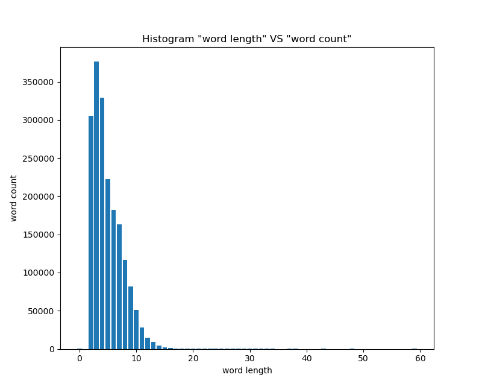
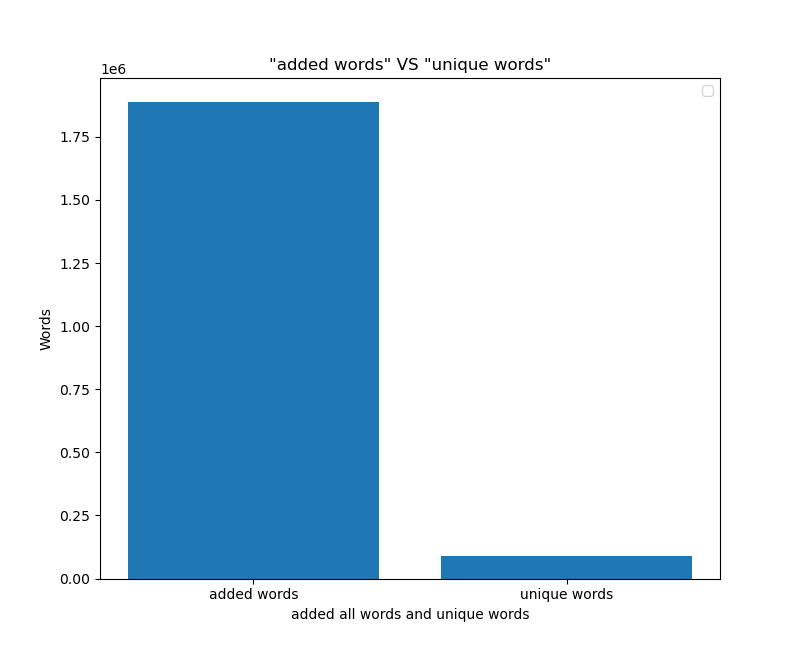

# Mini-project report 
Members: Ma Xunwei, Tesfagiorgish William Issac, Valantyte Justina, Bwene Nzams  
Program: NGDNS-Eng  
Course: 1DV501   
Date of submission: 2021-12-03

## Introduction  
The project is about understanding hashing and binary search trees. We will use the two large text files we used in Assignment 3 as input data. The ``eng_news_100K-sentences.txt`` and ``holy_grail.txt`` in two separate files. 
1. Part 1 is counting unique words using Python's set class and use Python's dictionary class to produce a Top 10 list of the ten most frequently used words having a length larger than 4 in each file.
2. Part 2 is implementation of data structures such 1) Binary search trees (BST) , and 2) HashSet.
* The hash-based set is built using a Python list to store the buckets where each bucket is another Python list. The initial bucket list size is 8 and rehashing (double the bucket list size) takes place when the number of elements equals the number of buckets.
* The BST based map is a linked implementation where each node has four fields (key, value, left-child, right-child).
* Furthermore, we where given skeletons to complete programs in which we were not allowed to make any changes of the method signatures but able to add additional methods.
3. Part 3 is counting unique words using our own created hash based set and BST based map in Part 2. 
* As well as presenting a list of the top-10 most frequently used words having a length larger than 4 using our BstMap implementation.
* Showing the max bucket size for hash table after having added all words in the large text files ``holy_grail`` and ``eng_news_100K-sentences``.
* Presenting the max depth of the BST when adding all words (as both key and value) from the large text files ``holy_grail`` and ``eng_news_100K-sentences``.
* The results for the first two parts should be the same as in Part 1.

## Part 1: Count unique words 1
- We used 2 text files ``holy_grail_copy`` and ``eng_news_100K-sentences_copy`` which have separated words.
* Firstly we used ``unique()`` for filtering texts into unique words in order to get number of words. 
* After that under the function ``occurrences()`` we created empty list, then we used for loop to iterate over all the words in the files and if-statement to get the words having length larger the four. In addition, we used empty dictionary to append the words and its counts, so we used for loop to iterate over the words and then we added a counter for each word so we could see how many times they appeared. Later, we sorted everything in order. We needed to sort everything in reverse order so that the value was descending so that we could show **top 10** common words in these texts.
```python
print('Top 10 common words larger than 4 letters:')
    for i in range(10):
        print(f'{sort[i][0]} : {sort[i][1]}')
    return ''
```
- Presenting a unique word count and the Top-10 lists for each of the two files.


The number of different words in holy_grail.txt:  1923

|10 most frequently occurring words in holy grail|
|:----------------------------------------------:|
|arthur : 261                                    |
|launcelot : 101                                 |
|knight : 84                                     |
|galahad : 81                                    |
|father : 74                                     |
|bedevere : 68                                   |
|knights : 65                                    |
|robin : 58                                      |
|guard : 58                                      |
|right : 57                                      |

The number of different words in 100K-sentences.txt:  90199
|10 most frequently occurring words in 100k sentences|
|:--------------------------------------------------:|
|their : 6143                                        |
|about : 4606                                        |
|there : 3926                                        |
|would : 3877                                        |
|people : 3799                                       |
|which : 3571                                        |
|after : 3014                                        |
|years : 2984                                        |
|first : 2887                                        |
|other : 2754                                        |

## Part 2: Implementing data structures
- The task is to implement a set (suitable for words) based on hashing and a map based on binary search trees.
* The BST based map is a linked implementation where each node has four fields (key, value, left-child, right-child).
* The hash-based set is built using a Python list to store the buckets where each bucket is another Python list. 
* The initial bucket list size is 8 and rehashing (double the bucket list size) takes place when the number of elements equals the number of buckets.
* We were not allowed to make any changes of the method signatures in the given skeletons, but had the option to add additional methods. 
- For the hash based word set (HashSet):
 	* Python code for function ``add`` adds word in a set if it's not already added, in addition, the word is hashed by converting characters into its Unicode code value (ASCII), and rehashing.
	- First function we have is hashing which is ``def get_hash(self, word)``. It computes hash value by summing up ASCII characters into integers which then are assigned to different buckets by using modulus (remainder).
	 ```python
	 def get_hash(self, word):
        hash_1 = 0
        num = 1
        for char in word.lower():
            hash_1 += num * ord(char)
            num += 1
        return hash_1 % len(self.buckets)
	```
	- Second function is ``def rehash(self):`` which is needed to avoid colision and expanding number of buckets. First, we make a temporary list of buckets, then we add elements using append function. After that we simply remove original content from the buckets and double its size. In the end we add everything from temporary list to the new doubled sized one so that no duplicates arise.
	```python
	def rehash(self):
        bucket_new = []
        for i in self.buckets:
            for value in i:
                bucket_new.append(value)
        new_buckets = [[] for i in range(len(self.buckets))]
        self.buckets.extend(new_buckets)
        for lst in self.buckets:
            lst.clear()
        self.size = 0
        for i in bucket_new:
            self.add(i)
	```
	- Third function is ``def add(self, word):`` which adds elements to buckets. First, we hash the word and store it in seperate bucket, after it is appended into bucket list if it's not already there and adding the size by 1 increment. Finally, rehashing happens when the size is equal to buckets length.
	```python
	def add(self, word):
        hash_2 = self.get_hash(word)
        bucket = self.buckets[hash_2]
        if word not in bucket:
            bucket.append(word)
            self.size += 1
            if self.size == len(self.buckets):
                self.rehash()
	```
 	
- For the BST based map (BstMap):
* In the BstMap the ``put`` function adds elements into init. 4 nodes are included in the tree (key, value, left, and right). While the key value gets inserted, on the left side of root node are all subtree nodes with the less value and all with the great value separates into the right. The function calls itself (recursion) after comparing the key value and the root node.
```python
	def put(self, key, value):
        if key < self.key:
            # add it to leftsubtree
            if self.left is None:
                self.left = Node(key, value)
            else:
                self.left.put(key, value)
        elif key == self.key:
            self.value = value
        if key > self.key:
            # add to right subtree
            if self.right is None:
                self.right = Node(key, value)
            else:
                self.right.put(key, value)
```
``Max_depth`` is a recursion function on in-order traversal of the tree. It starts from the first node continiues through left down to the bottom and goes back upward to include every subtree node and the same with the right side, and finally 
returns upward to the max depth to the node.
```python
def max_depth(self):
        if self.key is None:
            return 0
        else:
            left_dep = 0
            right_dep = 0
            if self.left:
                left_dep = self.left.max_depth()
            if self.right:
                right_dep = self.right.max_depth()
            if (left_dep > right_dep):
                return left_dep + 1
            else:
                return right_dep + 1
```

## Part 3: Count unique words 2
- In this part we used simmilar technique to get top 10 list as in part one but only we used our BST from part 2. Firstly, we assigned a variable called ``words`` to call the binary search tree. Then we search the words that are larger than four and we call the function ``get`` from part two, that assignes count of the words. In addition, the words that appear for the first time has a count of one and everytime word appears the count is added by 1. After that it is sorted in descending order. To present, the top ten most used words, a for loop in range (10) is set.
```python
def popular(lst):
    words = BM.BstMap()
    for i in lst:
        if len(i) <= 4:
            continue
        words_value = words.get(i)
        if words_value is not None:
            words.put(i, words_value + 1)
        else:
            words.put(i, 1)
    counts = sorted(words.as_list(), key=lambda v: v[1], reverse=True)
    print("Top 10 used words larger than 4 letters:")
    for i in range(10):
        print(f'{counts[i][0]} : {counts[i][1]}')
    print("\nMax depth :", words.max_depth())
    return " "
```
-  Presenting a unique word count and the Top-10 lists for each of the two files.


The number of different words in holy_grail.txt:  1923
Holy grail max buckets: 12
Max depth : 22

|10 most frequently occurring words in holy grail|
|:----------------------------------------------:|
|arthur : 261                                    |
|launcelot : 101                                 |
|knight : 84                                     |
|galahad : 81                                    |
|father : 74                                     |
|bedevere : 68                                   |
|knights : 65                                    |
|robin : 58                                      |
|guard : 58                                      |
|right : 57                                      |

The number of different words in 100K-sentences.txt:  90199
Eng 100k sentences max buckets: 93 
Max depth : 41
|10 most frequently occurring words in 100k sentences|
|:--------------------------------------------------:|
|their : 6143                                        |
|about : 4606                                        |
|there : 3926                                        |
|would : 3877                                        |
|people : 3799                                       |
|which : 3571                                        |
|after : 3014                                        |
|years : 2984                                        |
|first : 2887                                        |
|other : 2754                                        |

## Part 4: Plotting
- We used our BstMap to count how many words of a given length the file has. In the code ``popular`` we assigned the walue of word length. Then from BST we used function ``words.as_list()`` so we could get tuples, made them into dictionary for easier access of keys and values.
```python
def popular(lst):
    words = BstMap.BstMap()
    for i in lst:
        words_value = words.get(len(i))
        if words_value is not None:
            words.put(len(i), words_value + 1)
        else:
            words.put(len(i), 1)
    return words
```
- Result:



- In second part we used our hashset. We implemented function ``un.get_size()`` to get the numbers of unique words.

- Result:


## Project conclusions and lessons learned

### Technical issues 
- The most challenging for us was understanding hash implementation as well as binary search trees methods, it took some time to research and implement our knowledge. The most time-consuming parts where Part 2 and Part 3. 
- We have learned how to work on tight schedule.
- If we had more time, we would have finished all parts.

### Project issues
- Our team worked together on all parts, giving input to each other. We communicated mostly using slack and giving feedback daily on messaging app.
- For each individual team member: 

- Ma Xunwei - part 4
- Tesfagiorgish William Issac - part 2 and report 
- Justina Valantyte - part 3 and report
- Bwene Nzams - part 1
- All oral presentation.

Time spent 3 days a week from 3-4 hours.
 - We would have liked to have full team to work with so that our workflow would not have been so time consumming.


